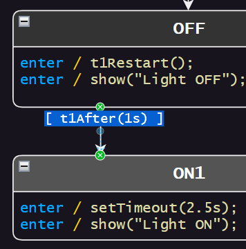
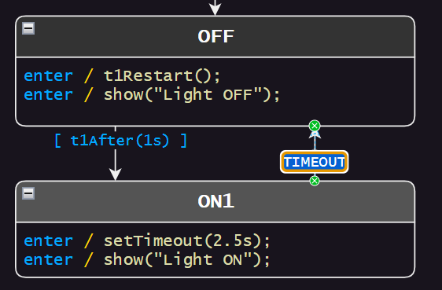

# Lesson 4 - Timing Stuff
This lesson is totally optional. If you don't need to do something relating to timing, feel free to skip it.


State machines can react to any time source you choose. You can use the current system time, a game time (that can be paused), a tick counter...

This flexibility does require a bit of wiring up by the user though.


<br>

# Improvements Coming
There are [plans to make this easier](https://github.com/StateSmith/StateSmith/issues/76) in the future.

Requires user feedback. I want whatever we implement to benefit all users and not just one specific language.


<br>

# Polled State Machines
Polled state machines need the `DO` event to be dispatched to them periodically. This enables them check guard conditions.

This is required for the below transition to function.

> **NOTE:** In StateSmith, if no event is specified (like below), StateSmith assumes the `DO` event.



`t1After(1s)` is an expansion that expands to the below. See the .csx file for how it is implemented.
```js
OFF_do()
{      
    // OFF behavior
    // uml: do [t1After(1s)] TransitionTo(ON1)
    if (Date.now() - this.vars.t1StartMs >= 1000)
    {
        // ...
    }
}
```


<br>

# Event Driven State Machines
Polling has a performance cost. If the language/framework that you are using supports timeouts, you can choose to have those timeouts dispatch an event (named whatever you like) to your state machine. This is how the other transition works:




<br>

# Explore `code_gen.csx`
Tweak the diagram, run the code gen, see the example live.


<br>

# Onwards!
Now we get to the language specific stuff :)

See [lesson 5 README.md](../lesson-5/README.md).
